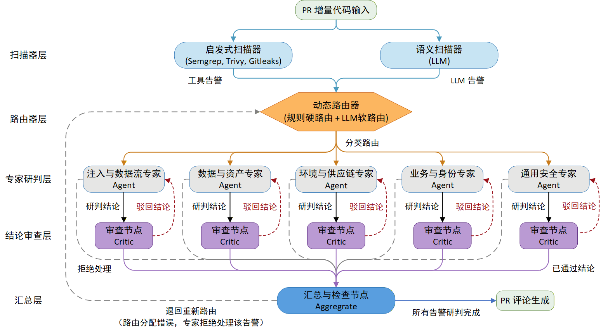

# Agentic-Code-Sec-Review
用于 Python 项目的 PR 增量代码多智能体审计系统。

## Setup
1. 在 Github 的 Actions secrets 中，使用 `LLM_API_KEY` 作为名称添加 LLM API key。
2. 在代码库中添加 `.github/workflows/agentic_code_sec_review.yml`，并修改其中 `llm_base_url` 为您的 LLM 基础 url，修改 `llm_model_name` 为您的 LLM 名称。
3. 将代码提交到您的仓库，并创建 Pull Requests，该 Action 会自动运行。（可修改 yml 中的 pull_request types，以调整触发条件）

<details>
<summary>点击展开查看完整的 agentic_code_sec_review.yml 配置文件</summary>

```yml
name: Agentic Code Sec Review

on:
  pull_request:
    types: [opened, synchronize, reopened]
    paths-ignore:
          - '**/*.md'
          - '**/*.json'
          - '**/*.yml'
          - '**/*.yaml'
          - 'docs/**'
  workflow_dispatch:

concurrency:
  group: ${{ github.workflow }}-${{ github.event.pull_request.number || github.ref }}
  cancel-in-progress: true

jobs:
  code-sec-review:
    name: PR Code Security Review
    runs-on: ubuntu-latest
    permissions:
      actions: read
      contents: read
      pull-requests: write

    steps:
      - name: Checkout Repository
        uses: actions/checkout@v4
        with:
          fetch-depth: 0
          ref: ${{ github.event.pull_request.head.sha }}

      - name: Run AI Auditor Action
        uses: lnjoy0/agentic-code-sec-review@main
        with:
          github_token: ${{ secrets.GITHUB_TOKEN }}
          llm_api_key: ${{ secrets.LLM_API_KEY }}
          llm_base_url: https://api.deepseek.com
          llm_model_name: deepseek-v4-flash
```

</details>

## Structure
该系统的整体架构如下图所示，主要组件包括扫描器、路由器、研判专家智能体与审查节点。
- **扫描器 (Scanner)**：分为启发式扫描器（Semgrep、Trivy、Gitleaks）和语义扫描器（LLM）两类。用于对 PR 中的增量代码进行快速、敏锐的安全扫描，寻找有可能是漏洞的安全疑点，并发出告警。
- **路由器 (Router)**：包括基于规则的硬路由与基于 LLM 的软路由。用于将扫描器的告警进行分类，并路由到不同专业领域的专家智能体处。其中，硬路由是指基于 CWE 或扫描器名称进行确定性的规则分类；软路由是使用 LLM 对语义扫描器告警或非常见 CWE 类型告警进行的语义分类。
- **研判专家智能体 (Expert Agent)**：用于对漏洞告警进行研判，判断是真实漏洞还是误报，在研判过程中可以查询漏洞知识文档、调用代码检索、项目结构查询等工具。其中按照不同安全领域划分为四类领域专家（注入与数据流专家、数据与资产专家、环境与供应链专家、业务与身份专家），以及一位用于处理长尾与模糊告警的通用专家。不同专家被分配有不同的系统提示词、漏洞文档集以及工具。
  - 当前的工具包括：代码检索工具（包括查询函数或类的定义/引用，查询单文件内的数据流等）、项目分析工具（包括查询目录树、全局搜索等）、漏洞知识文档检索工具（查询目标漏洞类型的知识文档）、绕过技巧查询工具（专用于数据流专家，在遇到清洗或过滤时调用）
  - 其中，代码检索工具基于 tree-sitter 和 ripgrep，因此能够以极快的速度进行检索。
- **审查节点 (Critic)**：用于对专家智能体给出的研判结论进行审查，判断其证据链的完整性、逻辑的严密性以及结论的正确性。



## Expirement
使用存在真实 CVE 漏洞的代码进行实验，以验证该系统的检测能力。

**实验方法**：LLM 使用 deepseek-v4-flash，样本包括开源 Python 项目中的 35 个 CVE 漏洞。具体实验方法是将 CVE 的补丁 commit 反向提交，并创建一个 PR，触发此 Action 进行检测。

**实验结果**：如下表所示。由于研判专家 Agent 可以调用代码检索等工具，通过反复调用工具，可以获得完整函数/类定义、变量数据流、框架配置等信息，便于其对漏洞进行深入的分析与研判，因此对于常规漏洞有着较高的召回率。而受限于 LLM 能力、项目业务信息的缺失，在面对多步复杂漏洞或业务逻辑漏洞时，可能会出现幻觉或对相关安全知识不敏感的现象。

<details>
<summary>点击展开查看完整的实验结果表格</summary>

| repo name                                  | vuln type                              | cve                | hit  | fix commit                               | comment url                                                                                   |
| :----------------------------------------- | :------------------------------------- | :----------------- | :--- | :--------------------------------------- | :-------------------------------------------------------------------------------------------- |
| MobSF/Mobile-Security-Framework-MobSF      | SSRF                                   | ['CVE-2025-31116'] | √    | 4b8bab5a9858c69fe13be4631b82d82186e0d3bd | https://github.com/lnjoy0/Mobile-Security-Framework-MobSF/pull/5#pullrequestreview-4494153165 |
| MobSF/Mobile-Security-Framework-MobSF      | ZIP bomb                               | ['CVE-2025-46730'] | √    | 6987a946485a795f4fd38cebdb4860b368a1995d | https://github.com/lnjoy0/Mobile-Security-Framework-MobSF/pull/7#discussion_r3443666219       |
| MobSF/Mobile-Security-Framework-MobSF      | svg图片存储型XSS                       | ['CVE-2025-46335'] |      | 6987a946485a795f4fd38cebdb4860b368a1995d |                                                                                               |
| MobSF/Mobile-Security-Framework-MobSF      | DOS                                    | ['CVE-2025-24804'] |      | 05206e72cae35b311615a70e51e1a946955c5e83 |                                                                                               |
| MobSF/Mobile-Security-Framework-MobSF      | 密钥泄露                               | ['CVE-2025-24805'] | √    | 05206e72cae35b311615a70e51e1a946955c5e83 | https://github.com/lnjoy0/Mobile-Security-Framework-MobSF/pull/8#discussion_r3443735878       |
| MobSF/Mobile-Security-Framework-MobSF      | 存储型XSS                              | ['CVE-2025-24803'] | √    | 05206e72cae35b311615a70e51e1a946955c5e83 | https://github.com/lnjoy0/Mobile-Security-Framework-MobSF/pull/8#discussion_r3443735886       |
| OctoPrint/OctoPrint                        | 越权访问                               | ['CVE-2025-32788'] | √    | 41ff431014edfa18ca1a01897b10463934dc7fc2 | https://github.com/lnjoy0/OctoPrint/pull/1#discussion_r3410850330                             |
| ZOO-Project/ZOO-Project                    | 反射型XSS                              | ['CVE-2025-25190'] | √    | 7a5ae1a10faa2f9877d18ec72550dc23e8ce1aac | https://github.com/lnjoy0/ZOO-Project/pull/1#discussion_r3410998778                           |
| binary-husky/gpt_academic                  | 路径穿越、符号链接                     | ['CVE-2025-25185'] | √    | 5dffe8627f681d7006cebcba27def038bb691949 | https://github.com/lnjoy0/gpt_academic/pull/2#discussion_r3411319248                          |
| ckan/ckan                                  | 存储型XSS                              | ['CVE-2025-24372'] | √    | 7da6a26c6183e0a97a356d1b1d2407f3ecc7b9c8 | https://github.com/lnjoy0/ckan/pull/1#discussion_r3411746941                                  |
| conda-forge/conda-forge-ci-setup-feedstock | 代码执行                               | ['CVE-2025-49598'] |      | fd91cb271c01f0e7928ebdc1feaac96fe385f959 |                                                                                               |
| conda/conda-build                          | 代码执行                               | ['CVE-2025-32798'] | √    | 3d87213b840774a24ab1733664d2b36664233754 | https://github.com/lnjoy0/conda-build/pull/4#discussion_r3412604328                           |
| conda/conda-build                          | tar解压时路径穿越                      | ['CVE-2025-32799'] | √    | bdf5e0022cec9a0c1378cca3f2dc8c92b4834673 | https://github.com/lnjoy0/conda-build/pull/5#discussion_r3412701921                           |
| conda/conda-build                          | 命令执行                               | ['CVE-2025-32797'] | √    | d246e49c8f45e8033915156ee3d77769926f3c2e | https://github.com/lnjoy0/conda-build/pull/8#discussion_r3443883761                           |
| conda/conda-build                          | 命名空间劫持（使用未在PyPI发布的依赖） | ['CVE-2025-32800'] |      | f5a6aeef0d5d6940b8c2a88796910dc7476a62bb |                                                                                               |
| eventlet/eventlet                          | HTTP请求走私                           | ['CVE-2025-58068'] | √    | 0bfebd1117d392559e25b4bfbfcc941754de88fb | https://github.com/lnjoy0/eventlet/pull/2#discussion_r3447606632                              |
| goauthentik/authentik                      | 不充分的会话终止                       | ['CVE-2025-29928'] | √    | 71294b7deb6eb5726a782de83b957eaf25fc4cf6 | https://github.com/lnjoy0/authentik_test/pull/4#discussion_r3445722420                        |
| goauthentik/authentik                      | 会话验证不足-IDOR                      | ['CVE-2025-52553'] | √    | 7100d3c6741853f1cfe3ea2073ba01823ab55caa | https://github.com/lnjoy0/authentik_test/pull/1#discussion_r3418337675                        |
| goauthentik/authentik                      | 权限管理不足                           | ['CVE-2025-53942'] | √    | 7a4c6b9b50f8b837133a7a1fd2cb9b7f18a145cd | https://github.com/lnjoy0/authentik_test/pull/2#discussion_r3418392081                        |
| rommapp/romm                               | 路径穿越                               | ['CVE-2025-53908'] | √    | baa1a9759079c36e36a9f10c920c46b57d0b6151 | https://github.com/lnjoy0/romm/pull/1#discussion_r3418457402                                  |
| run-llama/llama_index                      | billion laughs                         | ['CVE-2025-3225']  | √    | 4f6ee062b19212106a2632af9c9521fc7f0a3584 | https://github.com/lnjoy0/llama_index/pull/1#discussion_r3418846828                           |
| run-llama/llama_index                      | 递归深度无限制-DOS                     | ['CVE-2025-5302']  | √    | c032843a02ce38fd8f284b2aa5a37fd1c17ae635 | https://github.com/lnjoy0/llama_index/pull/3#discussion_r3419174178                           |
| run-llama/llama_index                      | 递归深度无限制-DOS                     | ['CVE-2025-1752']  | √    | 3c65db2947271de3bd1927dc66a044da385de4da | https://github.com/lnjoy0/llama_index/pull/4#discussion_r3419283885                           |
| run-llama/llama_index                      | 二阶命令执行                           | ['CVE-2025-1753']  | √    | b57e76738c53ca82d88658b82f2d82d1c7839c7d | https://github.com/lnjoy0/llama_index/pull/19#discussion_r3443220924                          |
| run-llama/llama_index                      | 路径穿越                               | ['CVE-2025-6209']  | √    | cdeaab91a204d1c3527f177dac37390327aef274 | https://github.com/lnjoy0/llama_index/pull/7#discussion_r3425448428                           |
| run-llama/llama_index                      | 哈希碰撞导致文档覆盖-逻辑漏洞          | ['CVE-2025-6211']  |      | 29b2e07e64ed7d302b1cc058185560b28eaa1352 |                                                                                               |
| run-llama/llama_index                      | SQL注入                                | ['CVE-2025-1750']  | √    | 369a2942df2efcf6b74461c45d20a0af1fbe4ae2 | https://github.com/lnjoy0/llama_index/pull/10#discussion_r3426503458                          |
| run-llama/llama_index                      | 路径穿越、符号链接                     | ['CVE-2025-3046']  | √    | 266eb3b3a61f158112726d75a5f5f0b90e34ded0 | https://github.com/lnjoy0/llama_index/pull/12#discussion_r3426732545                          |
| run-llama/llama_index                      | 哈希碰撞导致文档覆盖-逻辑漏洞          | ['CVE-2025-3044']  |      | f69e1c0e7579228fec4cfaf716e4f951e131de77 |                                                                                               |
| run-llama/llama_index                      | SQL注入                                | ['CVE-2025-1793']  | √    | 201d3f5408055c5c6825bc37304b9dcc9d46e5ab | https://github.com/lnjoy0/llama_index/pull/14#discussion_r3427313618                          |
| run-llama/llama_index                      | 反序列化-RCE（危险的公共API）          | ['CVE-2025-3108']  |      | 702e4340623092fac4cf2fe95eb9465034856da3 |                                                                                               |
| seperman/deepdiff                          | Python 对象属性注入-类污染             | ['CVE-2025-58367'] | √    | c69c06c13f75e849c770ade3f556cd16209fd183 | https://github.com/lnjoy0/deepdiff/pull/1#discussion_r3430426421                              |
| vulnerability-lookup/vulnerability-lookup  | 存储型XSS                              | ['CVE-2025-32413'] | √    | 0a120af1de4a0a13bc2e2000f3c4639291122ba0 | https://github.com/lnjoy0/vulnerability-lookup/pull/1#discussion_r3430525836                  |
| protocolbuffers/protobuf                   | 递归深度无限制-DOS                     | ['CVE-2025-4565']  | √    | 17838beda2943d08b8a9d4df5b68f5f04f26d901 | https://github.com/lnjoy0/protobuf/pull/1#discussion_r3432861465                              |
| FunAudioLLM/FunMusic                       | 反序列化（torch.load ）                | ['CVE-2025-5148']  | √    | 784cbf8dde2cf1456ff808aeba23177e1810e7a9 | https://github.com/lnjoy0/FunMusic/pull/2#discussion_r3442988935                              |

</details>

## Optimization Methods
可以采用的进一步优化方法，包括：

1. **细化 LLM 扫描器**：当前的 LLM 扫描器使用相同的提示词扫描所有类型漏洞，因此对少见的长尾漏洞并不敏感。可以按领域划分多个 LLM 扫描器，一个扫描器仅需检测某一类型漏洞，这会使注意力更集中，能提高召回率。这会增加 token 消耗，但扫描器的 token 消耗相对专家智能体要少得多（仅扫描一次增量代码），这个优化的性价比仍然较高。
2. **增加知识文档**：当前的知识库中只有常见漏洞的知识文档，当面对少见的长尾漏洞时，专家在研判过程中会没有知识文档的支撑，可能会出现幻觉。因此，增加更多、分类更细的漏洞知识文档或绕过技巧文档，能显著提升 Agent 对长尾漏洞的研判能力。
3. **LLM 微调**：当前的通用 LLM 其实已经拥有了进行漏洞研判所需的专业知识，但在实际研判过程中，可能无法敏感地触发这些知识。使用高质量的漏洞研判数据集进行 LLM 微调，可以让 LLM 深度对齐研判专家的思考范式与审查重点，从而能提高研判过程中各个方面的性能。但微调的难点在于高质量漏洞研判数据集的准备。
4. **添加评论聚合与润色节点**：当前的评论内容由专家智能体生成，其格式时好时坏，且内容中可能会包含与审查节点的辩论内容；此外，扫描器可能扫描出多个位置的漏洞，但研判后发现其核心机理相同，这时会创建多个类似的 comment。因此，可以新增一个 LLM 节点来进行评论聚合与格式润色。不过这也会增加 token 消耗，而且该问题只影响格式美观，不影响审计效果，因此优先级不高。